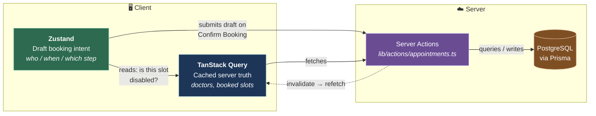
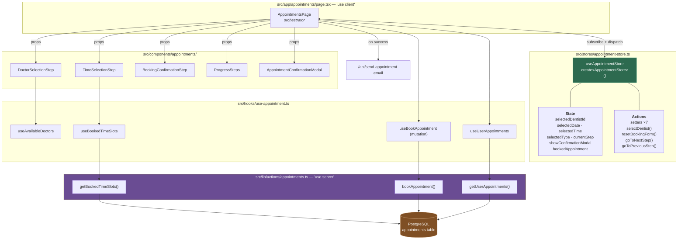
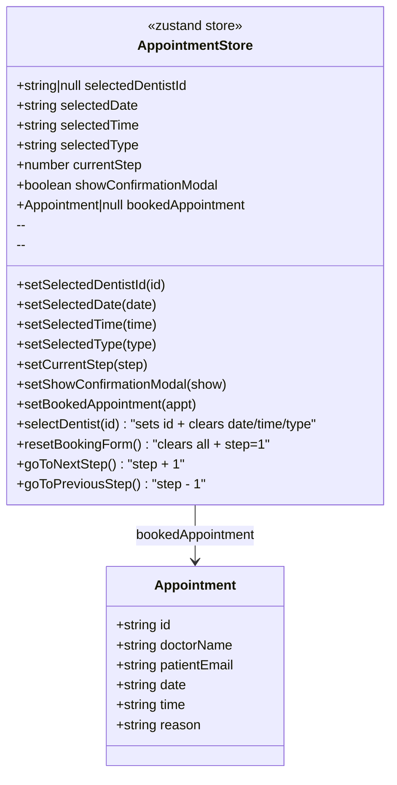
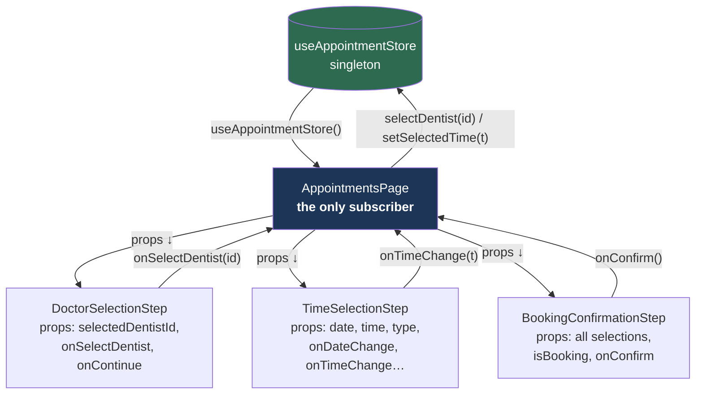
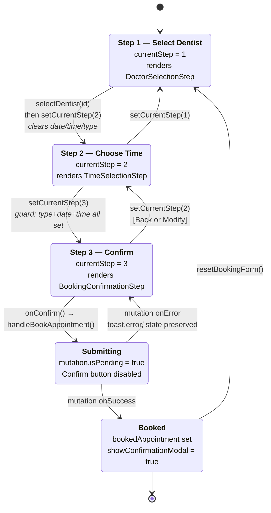
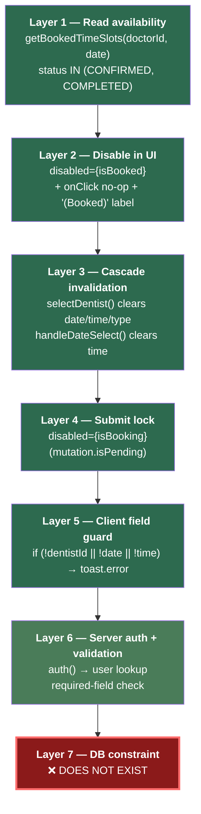
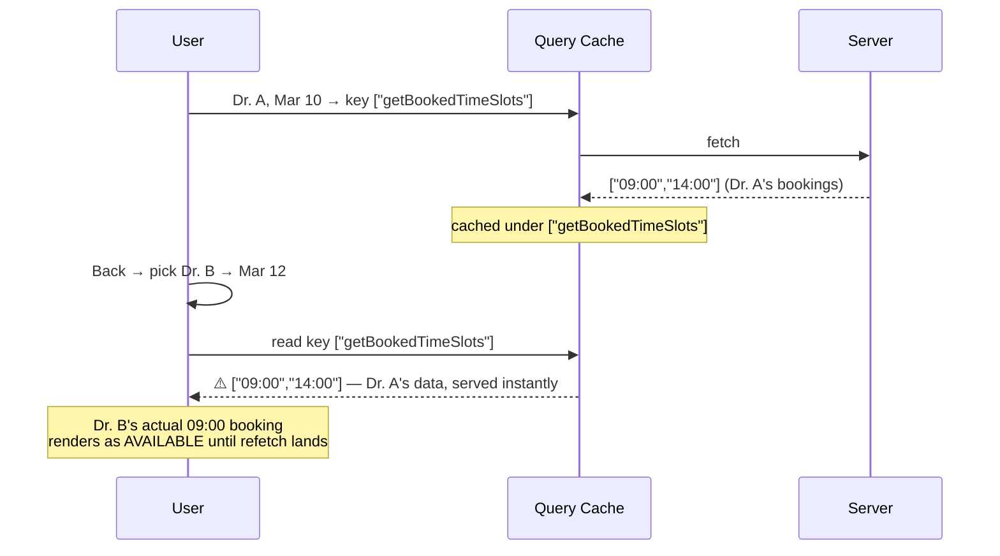
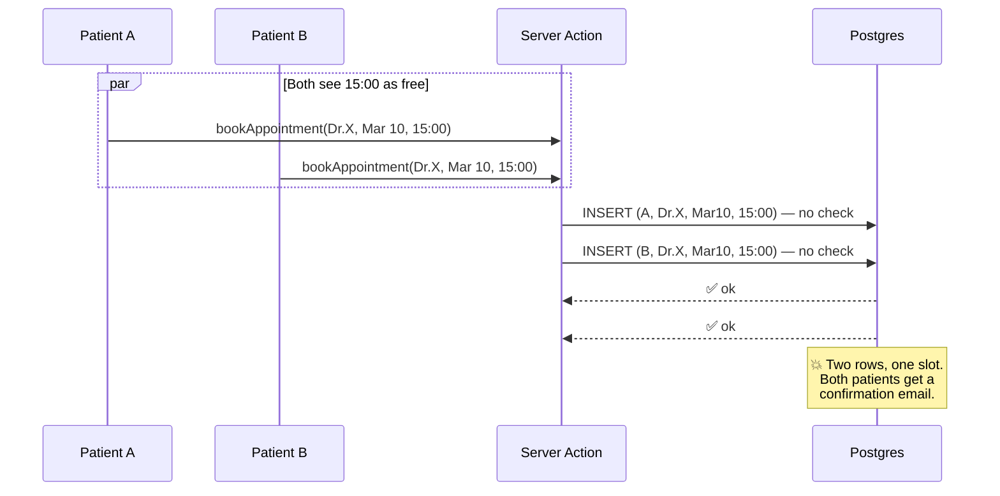
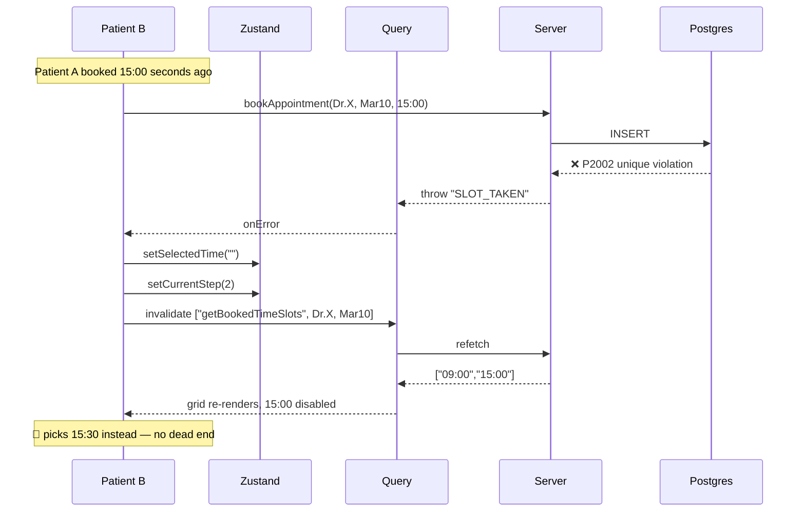

# Zustand & the Appointment Scheduling Flow in DentWise

> Deep technical walkthrough of how client state (Zustand), server state (TanStack Query),
> Server Actions, and Prisma/Postgres cooperate to book a dental appointment — and exactly
> where double-booking is (and isn't) prevented.
>
> **Stack as installed:** `zustand@^5.0.9` · `@tanstack/react-query@^5.89.0` · `next@^16.1.1` ·
> `react@^19.2.3` · `@prisma/client@^5.22.0` · Clerk auth · PostgreSQL

---

## Table of Contents

1. [The core idea: two kinds of state](#1-the-core-idea-two-kinds-of-state)
2. [System architecture](#2-system-architecture)
3. [The Zustand store, line by line](#3-the-zustand-store-line-by-line)
4. [How the store is consumed](#4-how-the-store-is-consumed)
5. [The three-step wizard as a state machine](#5-the-three-step-wizard-as-a-state-machine)
6. [End-to-end booking sequence](#6-end-to-end-booking-sequence)
7. [Double booking: the defense layers you have today](#7-double-booking-the-defense-layers-you-have-today)
8. [Double booking: the holes that are still open](#8-double-booking-the-holes-that-are-still-open)
9. [Hardening plan (concrete code)](#9-hardening-plan-concrete-code)
10. [Zustand-specific notes, gotchas & performance](#10-zustand-specific-notes-gotchas--performance)
11. [File map](#11-file-map)

---

## 1. The core idea: two kinds of state

The single most important architectural decision in this feature is that **Zustand is not used
to store appointments**. It stores *the act of booking one*.

| | **Zustand** (`useAppointmentStore`) | **TanStack Query** (`use-appointment.ts`) |
|---|---|---|
| Owns | Draft/wizard state | Server-owned truth |
| Examples | `currentStep`, `selectedDate`, `selectedTime` | doctors list, booked slots, user's appointments |
| Lifetime | Until booking completes or tab closes | Until invalidated / refetched |
| Source of truth? | ❌ No — it's a *proposal* | ✅ Yes — mirrors Postgres |
| Can it be stale? | Irrelevant (it's user intent) | Yes — and that's the crux of double booking |
| Survives refresh? | No (in-memory, no `persist`) | No, but refetches immediately |



**Why this split matters for double booking:** a slot's availability lives in the *right-hand*
column. Zustand can happily hold `selectedTime = "14:00"` for a slot that another patient
grabbed 400 ms ago. Zustand is not wrong — it faithfully records what the user picked. The
correctness burden sits entirely on the refresh discipline of the Query layer and on the
server's final check. Sections 7–9 are about exactly that.

---

## 2. System architecture



### Data ownership boundary

```
┌──────────────────────── BROWSER ────────────────────────┐
│                                                          │
│  Zustand store (module singleton, no Provider)           │
│  ────────────────────────────────────────────            │
│  selectedDentistId : string | null   ← step 1 output     │
│  selectedDate      : "YYYY-MM-DD"    ← step 2 output     │
│  selectedTime      : "HH:mm"         ← step 2 output     │
│  selectedType      : "checkup"|...   ← step 2 output     │
│  currentStep       : 1 | 2 | 3       ← wizard pointer    │
│  showConfirmationModal : boolean     ← post-book UI      │
│  bookedAppointment : Appointment|null← post-book receipt │
│                                                          │
│  TanStack Query cache                                    │
│  ────────────────────                                    │
│  ["getBookedTimeSlots"]  → string[]   ⚠️ see §8.1        │
│  ["getUserAppointments"] → Appointment[]                 │
│  ["doctors", ...]        → Doctor[]                      │
└──────────────────────────────────────────────────────────┘
                            │ Server Action RPC (POST)
┌──────────────────────── SERVER ─────────────────────────┐
│  Clerk auth() → clerkId → prisma.user.findUnique         │
│  prisma.appointment.create({ status: CONFIRMED })        │
└──────────────────────────────────────────────────────────┘
```

---

## 3. The Zustand store, line by line

File: `src/stores/appointment-store.ts`

### 3.1 Creation — no Provider, no context

```ts
export const useAppointmentStore = create<AppointmentStore>((set) => ({ ... }));
```

`create()` returns a **hook that is also a vanilla store**. There is no `<Provider>` anywhere in
the tree — the store is a module-level singleton created on first import. Consequences:

- ✅ Any component at any depth can read it without prop drilling or context nesting.
- ✅ Zero boilerplate compared to Redux (no reducers, actions, dispatch, or `configureStore`).
- ⚠️ The store is **shared across the whole client session**. A Next.js soft navigation away from
  `/appointments` and back does *not* reset it — the module never unmounts. Half-finished
  wizard state survives. (See §10.3.)
- ⚠️ In a Server Component / SSR context a module singleton would be shared across requests —
  safe here only because `page.tsx` is `"use client"` and the store is never touched on the server.

### 3.2 The `set` function — shallow merge, not replace

Zustand's `set` shallow-merges by default. Both forms are used in the store:

```ts
// Object form — for updates that don't depend on current state
setSelectedDate: (date) => set({ selectedDate: date }),

// Updater form — REQUIRED when deriving from current state
goToNextStep: () => set((state) => ({ currentStep: state.currentStep + 1 })),
```

The updater form in `goToNextStep`/`goToPreviousStep` is correct and deliberate: reading
`currentStep` from a closure instead would risk operating on a stale snapshot under React 18+
batching or concurrent rendering.

### 3.3 Simple setters vs. compound actions

Seven simple setters map 1:1 to fields. The interesting logic lives in three **compound actions**
that mutate several fields atomically — a single `set()` call is one notification, one re-render:

```ts
selectDentist: (dentistId) => set({
  selectedDentistId: dentistId,
  selectedDate: '',      // ← invalidate downstream choices
  selectedTime: '',      // ← THIS LINE IS A DOUBLE-BOOKING DEFENSE
  selectedType: '',
}),

resetBookingForm: () => set({
  selectedDentistId: null,
  selectedDate: '',
  selectedTime: '',
  selectedType: '',
  currentStep: 1,
  // NOTE: bookedAppointment is deliberately NOT cleared —
  // the success modal still needs it to render.
}),
```

**`selectDentist` is a correctness feature, not a convenience.** Availability is a function of
`(doctorId, date)`. If the user picks Dr. A → 14:00, then goes back and picks Dr. B, keeping
`selectedTime = "14:00"` would carry an availability judgement made against Dr. A's calendar into
Dr. B's. Clearing the downstream fields forces re-derivation against fresh data. The same
cascade-invalidate principle appears in `TimeSelectionStep`:

```ts
// TimeSelectionStep.tsx:35-39
const handleDateSelect = (date: string) => {
  onDateChange(date);
  onTimeChange("");   // date changed ⇒ previously-chosen time is meaningless
};
```

### 3.4 State-shape diagram



---

## 4. How the store is consumed

`src/app/appointments/page.tsx` destructures the entire store in one call:

```ts
const {
  selectedDentistId, selectedDate, selectedTime, selectedType,
  currentStep, showConfirmationModal, bookedAppointment,
  setSelectedDate, setSelectedTime, setSelectedType, setCurrentStep,
  setShowConfirmationModal, setBookedAppointment,
  selectDentist, resetBookingForm,
} = useAppointmentStore();
```

Then the page acts as a **container**: it holds the Zustand subscription and passes plain props
down. The step components are pure and store-agnostic:



This is a defensible design — the step components stay testable and reusable — but it means the
page re-renders on **every** store change and no child benefits from Zustand's selector-based
render bailout. See §10.1 for the trade-off and the fix if you ever need it.

---

## 5. The three-step wizard as a state machine



### Render guards in `page.tsx`

```ts
{currentStep === 1 && <DoctorSelectionStep … />}
{currentStep === 2 && selectedDentistId && <TimeSelectionStep … />}
{currentStep === 3 && selectedDentistId && <BookingConfirmationStep … />}
```

The `&& selectedDentistId` guards are what let `TimeSelectionStep` and `BookingConfirmationStep`
declare `selectedDentistId: string` (non-nullable) in their prop types. The store's field is
`string | null`; the guard narrows it at the call site. Clean, type-safe, no `!` assertions.

### Forward-progress guards

Each step gates its own "continue" affordance rather than relying on a central validator:

| Step | Guard | Location |
|---|---|---|
| 1 → 2 | "Continue" button only renders when `selectedDentistId` is truthy | `DoctorSelectionStep.tsx:97` |
| 2 → 3 | "Review Booking" only renders when `selectedType && selectedDate && selectedTime` | `TimeSelectionStep.tsx:135` |
| 3 → submit | `disabled={isBooking}` + a re-check of all three fields inside `handleBookAppointment` | `BookingConfirmationStep.tsx:92`, `page.tsx:38` |

---

## 6. End-to-end booking sequence

```mermaid
sequenceDiagram
    autonumber
    actor U as Patient
    participant P as AppointmentsPage
    participant Z as Zustand Store
    participant Q as TanStack Query
    participant S as Server Action
    participant DB as Postgres

    rect rgb(30,60,45)
    Note over U,DB: STEP 1 — Choose dentist
    U->>P: click doctor card
    P->>Z: selectDentist(id)
    Z-->>Z: set { id, date:'', time:'', type:'' }
    Z-->>P: notify → re-render
    U->>P: click "Continue"
    P->>Z: setCurrentStep(2)
    end

    rect rgb(25,50,75)
    Note over U,DB: STEP 2 — Choose date & time
    U->>P: click a date
    P->>Z: setSelectedDate(d) + setSelectedTime('')
    Z-->>P: re-render with new date
    P->>Q: useBookedTimeSlots(doctorId, date)
    Q->>S: getBookedTimeSlots(doctorId, date)
    S->>DB: findMany({ doctorId, date, status: IN [CONFIRMED, COMPLETED] })
    DB-->>S: ["09:00","14:00"]
    S-->>Q: string[]
    Q-->>P: bookedTimeSlots
    P->>P: render 12 slot buttons;<br/>disabled = bookedTimeSlots.includes(time)
    U->>P: click "15:00" (enabled)
    P->>Z: setSelectedTime("15:00")
    U->>P: click "Review Booking"
    P->>Z: setCurrentStep(3)
    end

    rect rgb(60,40,80)
    Note over U,DB: STEP 3 — Confirm & write
    U->>P: click "Confirm Booking"
    P->>P: guard: dentistId && date && time ?
    P->>Q: bookAppointmentMutation.mutate({ doctorId, date, time, reason })
    Note over P: isPending = true → button disabled
    Q->>S: bookAppointment(input)
    S->>S: auth() → clerkId
    S->>DB: user.findUnique({ clerkId })
    S->>DB: appointment.create({ status: CONFIRMED })
    DB-->>S: row
    S-->>Q: transformAppointment(row)
    Q->>Q: invalidate ["getUserAppointments"]
    Q-->>P: onSuccess(appointment)
    P->>Z: setBookedAppointment(appointment)
    P->>P: POST /api/send-appointment-email
    P->>Z: setShowConfirmationModal(true)
    P->>Z: resetBookingForm()
    Z-->>P: step=1, selections cleared,<br/>bookedAppointment retained
    P-->>U: 🎉 confirmation modal
    end
```

### The success handler, annotated

`page.tsx:53-82` — the ordering here is load-bearing:

```ts
onSuccess: async (appointment) => {
  setBookedAppointment(appointment);   // 1. capture receipt FIRST
                                       //    (resetBookingForm would otherwise
                                       //     leave the modal with nothing to show)
  try {
    await fetch("/api/send-appointment-email", { … });   // 2. best-effort email
  } catch (error) {
    console.error(…);                  //    email failure must NOT fail the booking
  }

  setShowConfirmationModal(true);      // 3. open modal
  resetBookingForm();                  // 4. wizard back to step 1, selections cleared
}
```

Note the modal render guard at `page.tsx:140` — `{bookedAppointment && <AppointmentConfirmationModal … />}` —
which is why step 1 keeps `bookedAppointment` out of `resetBookingForm`'s reset set.

---

## 7. Double booking: the defense layers you have today



### Layer 1 — Availability read (`appointments.ts:99-117`)

```ts
export async function getBookedTimeSlots(doctorId: string, date: string) {
  const appointments = await prisma.appointment.findMany({
    where: {
      doctorId,
      date: new Date(date),
      status: { in: ["CONFIRMED", "COMPLETED"] },  // both block the slot
    },
    select: { time: true },
  });
  return appointments.map((a) => a.time);
}
```

Only `time` is selected — no patient data leaks to the client, which matters because this runs
for any authenticated user against any doctor.

Note the `catch` returns `[]`. **This fails open**: a DB hiccup makes every slot look available.
For a scheduling system, failing *closed* (surface the error, block booking) is the safer default.

### Layer 2 — UI disablement (`TimeSelectionStep.tsx:111-127`)

```ts
const isBooked = bookedTimeSlots.includes(time);
<Button
  onClick={() => !isBooked && onTimeChange(time)}   // belt
  disabled={isBooked}                                // and braces
  className={isBooked ? "opacity-50 cursor-not-allowed" : ""}
>
  {time}{isBooked && " (Booked)"}
</Button>
```

Both the `disabled` attribute *and* an `onClick` no-op guard. Redundant by design.

### Layer 3 — Zustand cascade invalidation

Covered in §3.3. This is the layer Zustand itself owns, and it's the reason a stale slot
selection can't silently survive a change of doctor or date.

### Layer 4 — Submit lock (`page.tsx:132` → `BookingConfirmationStep.tsx:92`)

`bookAppointmentMutation.isPending` flows down as `isBooking` and disables the Confirm button,
preventing the classic "impatient user clicks Confirm five times" self-double-booking.

---

## 8. Double booking: the holes that are still open

These are real defects in the current code, ordered by severity.

### 8.1 🔴 `useBookedTimeSlots` has a broken query key

`src/hooks/use-appointment.ts:21-27`

```ts
export function useBookedTimeSlots(doctorId: string, date: string) {
  return useQuery({
    queryKey: ["getBookedTimeSlots"],          // ⚠️ no doctorId, no date
    queryFn: () => getBookedTimeSlots(doctorId!, date),
    enabled: !!doctorId && !!date,
  });
}
```

The cache key doesn't include the parameters the query depends on. **Every (doctor, date) pair
shares one cache entry.**



Because `staleTime` defaults to `0`, a background refetch does follow — but the user sees and can
click a wrong grid in that window. Worse, if the refetch fails, the wrong data persists.

**Fix:**

```ts
queryKey: ["getBookedTimeSlots", doctorId, date],
```

### 8.2 🔴 Booking doesn't invalidate the availability cache

`src/hooks/use-appointment.ts:29-39`

```ts
onSuccess: () => {
  queryClient.invalidateQueries({ queryKey: ["getUserAppointments"] });
  // ⚠️ ["getBookedTimeSlots"] is never invalidated
}
```

After you book 15:00 with Dr. A, the availability cache still says 15:00 is free. Book →
"Book Another" → same doctor, same date → 15:00 renders as available → you can book it again.
**This is a self-double-booking path reachable with no concurrency at all.**

### 8.3 🔴 No database uniqueness constraint

`prisma/schema.prisma:53-73` — the `Appointment` model has no `@@unique` on
`(doctorId, date, time)`. Nothing at the storage layer prevents two rows for the same slot.

Every other layer is advisory. The database is the only place a guarantee can actually live,
because it's the only serialization point two concurrent requests both pass through.

### 8.4 🔴 `bookAppointment` performs no availability check

`appointments.ts:126-164` validates auth and required fields, then goes straight to `create`.
Combined with 8.3, two simultaneous requests for the same slot both succeed:



Adding only a check-then-insert **does not fix this** — it narrows the race window from seconds
to microseconds but leaves it open (classic TOCTOU). The check must be backed by a constraint.

### 8.5 🟠 Appointment duration is ignored in slot math

`APPOINTMENT_TYPES` (`utils.ts:62-67`) declares 60/45/30-minute treatments, and the schema has
`duration Int @default(30)`. But:

- `bookAppointment` never writes `duration` — every row gets the default 30.
- The slot grid is a fixed 30-minute list (`getAvailableTimeSlots`).
- `getBookedTimeSlots` blocks only the *exact* start time string.

So a 60-minute "Regular Checkup" at 14:00 blocks 14:00 but leaves 14:30 bookable — a **guaranteed
overlap**, not even a race. This is double booking by modelling omission.

```
Requested:  Regular Checkup (60 min) @ 14:00
Actually blocks:  [14:00] only
Should block:     [14:00, 14:30]

 13:30   14:00   14:30   15:00
   │       ├───── checkup (60m) ─────┤
   │       │  🔒   │  ⚠️ open │
```

### 8.6 🟠 `getBookedTimeSlots` fails open

Already noted in §7. `catch → return []` means "on error, everything is available."

### 8.7 🟡 Date/timezone drift

- `getNext5Days()` builds dates from local `new Date()` then serializes with `.toISOString()`.
  For a user at UTC-5 late in the evening, the local date and the ISO date differ by one day.
- `new Date("2026-03-10")` parses as **UTC midnight**. Writes (`bookAppointment`) and reads
  (`getBookedTimeSlots`) both do this, so they're mutually consistent — the bug doesn't corrupt
  availability matching. But the label shown to the user
  (`new Date(selectedDate).toLocaleDateString()`) renders that UTC instant in *local* time, so a
  user behind UTC can see the previous day's name on the confirmation screen.

Storing a single UTC `DateTime` for the slot start (date + time combined) eliminates the whole
class of problem and makes duration math trivial.

### 8.8 🟡 Only two appointment statuses exist

`enum AppointmentStatus { CONFIRMED, COMPLETED }` — there's no `CANCELLED`. Cancelling means
deleting the row, which loses history, and `getBookedTimeSlots`'s `status: { in: [...] }` filter
implies an intent to exclude non-blocking statuses that currently can't exist.

---

## 9. Hardening plan (concrete code)

### Fix 1 — Correct the query keys and invalidation *(highest value, smallest change)*

```ts
// src/hooks/use-appointment.ts

export function useBookedTimeSlots(doctorId: string, date: string) {
  return useQuery({
    queryKey: ["getBookedTimeSlots", doctorId, date],   // ← parameterised
    queryFn: () => getBookedTimeSlots(doctorId, date),
    enabled: !!doctorId && !!date,
    staleTime: 15_000,        // brief cache, then treat as stale
    refetchOnWindowFocus: true, // returning to the tab re-checks availability
  });
}

export function useBookAppointment() {
  const queryClient = useQueryClient();
  return useMutation({
    mutationFn: bookAppointment,
    onSuccess: () => {
      queryClient.invalidateQueries({ queryKey: ["getUserAppointments"] });
      queryClient.invalidateQueries({ queryKey: ["getBookedTimeSlots"] }); // prefix-match: all doctor/date pairs
    },
    onError: (error) => console.error("Failed to book appointment:", error),
  });
}
```

`invalidateQueries` matches by key **prefix**, so `["getBookedTimeSlots"]` invalidates every
parameterised entry underneath it.

### Fix 2 — Add the database constraint *(the only real guarantee)*

```prisma
model Appointment {
  // …existing fields…

  @@unique([doctorId, date, time], name: "unique_doctor_slot")
  @@index([doctorId, date])   // speeds up getBookedTimeSlots
  @@map("appointments")
}
```

Then `npx prisma db push` (you're on a push workflow — no `prisma/migrations` directory).

> ⚠️ **Before pushing:** the constraint creation fails if duplicate slots already exist. Check first:
> ```sql
> SELECT "doctorId", date, time, COUNT(*)
> FROM appointments GROUP BY 1,2,3 HAVING COUNT(*) > 1;
> ```
> Resolve any rows it returns, then push.

### Fix 3 — Make the server action race-safe and fail closed

```ts
// src/lib/actions/appointments.ts
import { Prisma } from "@prisma/client";

export async function bookAppointment(input: BookAppointmentInput) {
  const { userId } = await auth();
  if (!userId) throw new Error("You must be logged in to book an appointment");
  if (!input.doctorId || !input.date || !input.time) {
    throw new Error("Doctor, date, and time are required");
  }

  const user = await prisma.user.findUnique({ where: { clerkId: userId } });
  if (!user) throw new Error("User not found. Please ensure your account is properly set up.");

  try {
    const appointment = await prisma.appointment.create({
      data: {
        userId: user.id,
        doctorId: input.doctorId,
        date: new Date(input.date),
        time: input.time,
        duration: input.duration ?? 30,           // ← actually persist it
        reason: input.reason || "General consultation",
        status: "CONFIRMED",
      },
      include: {
        user: { select: { firstName: true, lastName: true, email: true } },
        doctor: { select: { name: true, imageUrl: true } },
      },
    });
    return transformAppointment(appointment);
  } catch (error) {
    // P2002 = unique constraint violation ⇒ someone won the race
    if (error instanceof Prisma.PrismaClientKnownRequestError && error.code === "P2002") {
      throw new Error("SLOT_TAKEN");
    }
    console.error("Error booking appointment:", error);
    throw new Error("Failed to book appointment. Please try again later.");
  }
}
```

Two things to notice:

1. The `try` no longer wraps the auth/validation checks. In the current code it does, so a
   deliberate `throw new Error("You must be logged in…")` is caught and re-thrown as the generic
   `"Failed to book appointment…"` — **every specific error message is currently swallowed.**
2. `SLOT_TAKEN` is a distinct, machine-readable error the UI can act on.

And make the read fail closed:

```ts
export async function getBookedTimeSlots(doctorId: string, date: string) {
  const appointments = await prisma.appointment.findMany({
    where: { doctorId, date: new Date(date), status: { in: ["CONFIRMED", "COMPLETED"] } },
    select: { time: true },
  });
  return appointments.map((a) => a.time);
  // no catch → the error propagates to TanStack Query, the UI shows an
  // error state instead of a falsely-empty (all-available) grid
}
```

### Fix 4 — Handle `SLOT_TAKEN` in the UI, driven through Zustand

```ts
// src/app/appointments/page.tsx — inside bookAppointmentMutation.mutate options
onError: (error) => {
  if (error.message === "SLOT_TAKEN") {
    toast.error("Sorry — that slot was just booked by someone else. Please pick another time.");
    setSelectedTime("");     // Zustand: drop the now-invalid selection
    setCurrentStep(2);       // Zustand: send the user back to the time grid
    queryClient.invalidateQueries({ queryKey: ["getBookedTimeSlots", selectedDentistId, selectedDate] });
    return;
  }
  toast.error(`Failed to book appointment: ${error.message}`);
},
```

This is Zustand doing exactly what it should: translating a server-side conflict into a coherent
**client-side recovery path**. The user isn't dumped on an error page — they're returned to
step 2 with a refreshed grid and the taken slot now greyed out.



### Fix 5 — Model duration properly (removes §8.5 entirely)

Send the real duration and expand blocked slots server-side:

```ts
// src/lib/utils.ts — add machine-readable minutes
export const APPOINTMENT_TYPES = [
  { id: "checkup",      name: "Regular Checkup", duration: "60 min", minutes: 60, price: "$120" },
  { id: "cleaning",     name: "Teeth Cleaning",  duration: "45 min", minutes: 45, price: "$90"  },
  { id: "consultation", name: "Consultation",    duration: "30 min", minutes: 30, price: "$75"  },
  { id: "emergency",    name: "Emergency Visit", duration: "30 min", minutes: 30, price: "$150" },
];

// helper: which 30-min grid slots does an appointment occupy?
export function slotsCovered(startTime: string, minutes: number): string[] {
  const grid = getAvailableTimeSlots();
  const i = grid.indexOf(startTime);
  if (i === -1) return [startTime];
  return grid.slice(i, i + Math.ceil(minutes / 30));
}
```

```ts
// getBookedTimeSlots — block every covered slot, not just the start
const appointments = await prisma.appointment.findMany({
  where: { doctorId, date: new Date(date), status: { in: ["CONFIRMED", "COMPLETED"] } },
  select: { time: true, duration: true },
});
return appointments.flatMap((a) => slotsCovered(a.time, a.duration));
```

Then pass `minutes` through from `page.tsx`:

```ts
bookAppointmentMutation.mutate({
  doctorId: selectedDentistId,
  date: selectedDate,
  time: selectedTime,
  duration: appointmentType?.minutes ?? 30,   // ← was never sent
  reason: appointmentType?.name,
});
```

> A 60-minute appointment now needs its *tail* slots free too. The `@@unique` constraint only
> guards the start slot, so overlap protection for multi-slot bookings needs a transaction that
> re-reads the covered range and inserts inside `prisma.$transaction` at
> `Serializable` isolation — or, more simply, one row per 30-minute block linked by a booking id.

### Priority order

| # | Fix | Effort | Impact |
|---|---|---|---|
| 1 | Query key + invalidation (§9.1) | 5 min | Kills the no-concurrency self-double-book |
| 2 | `@@unique([doctorId, date, time])` (§9.2) | 10 min | The actual guarantee |
| 3 | P2002 handling + fail closed (§9.3) | 20 min | Correct errors surface |
| 4 | `SLOT_TAKEN` UX recovery (§9.4) | 20 min | No dead ends for the loser of a race |
| 5 | Duration modelling (§9.5) | 1–2 h | Removes the guaranteed overlap bug |

---

## 10. Zustand-specific notes, gotchas & performance

### 10.1 Whole-store subscription re-renders on everything

```ts
const { selectedDentistId, currentStep, /* …14 items… */ } = useAppointmentStore();
```

Calling the hook with no selector subscribes to the **entire state object**. Any `set()` —
including ones the page doesn't read — re-renders `AppointmentsPage` and, since props are passed
down, its whole subtree.

At this scale (one page, ~7 fields) that's genuinely fine and the readability is worth it. If it
ever matters, the selector form gives per-field subscriptions:

```ts
// Narrow subscriptions — component re-renders only when THAT slice changes
const currentStep   = useAppointmentStore((s) => s.currentStep);
const selectedTime  = useAppointmentStore((s) => s.selectedTime);

// Actions have stable identities, so grabbing them separately never causes re-renders
const setSelectedTime = useAppointmentStore((s) => s.setSelectedTime);
```

⚠️ **Zustand v5 caveat (you're on 5.0.9):** returning a *new object* from a selector triggers an
infinite-render warning, because v5 dropped the automatic shallow-equality that v4 applied. If
you want a multi-field selector, you must opt in explicitly:

```ts
import { useShallow } from "zustand/react/shallow";

const { selectedDate, selectedTime } = useAppointmentStore(
  useShallow((s) => ({ selectedDate: s.selectedDate, selectedTime: s.selectedTime }))
);
```

### 10.2 Actions have stable identities — no `useCallback` needed

Because the store object is created once, `selectDentist`, `setSelectedTime`, etc. are the same
function references for the life of the page. Passing them straight into props (as `page.tsx`
does) never breaks `React.memo` on children. That's a genuine advantage over `useState` +
inline arrow handlers.

### 10.3 The store outlives the page

There's no unmount cleanup. Consider this flow:

```
/appointments → pick Dr. A → pick Mar 12, 15:00 → navigate to /dashboard
              → navigate back to /appointments
              → wizard is still on step 3, still holding Mar 12 15:00
```

The held slot may have been booked by someone else in the meantime, and the user lands directly
on a confirmation screen they didn't rebuild. Two options:

```ts
// Option A — reset on mount
useEffect(() => {
  resetBookingForm();
}, []);   // resetBookingForm is stable, safe as a bare dep array

// Option B — treat it as a feature (resume where you left off), but force a
// re-validation of the held slot before allowing step 3 to render.
```

Option A is the right default for a scheduling flow — a stale draft against a live calendar is a
liability, not a convenience.

### 10.4 Not persisted — and that's correct

There's no `persist` middleware, so a hard refresh clears the draft. For appointment booking this
is the right call: a slot chosen yesterday and rehydrated from `localStorage` today is very likely
gone. If you ever add persistence, persist only `selectedDentistId` (the one field that doesn't
decay) and force re-selection of date/time.

### 10.5 Useful middleware if this grows

```ts
import { devtools } from "zustand/middleware";

export const useAppointmentStore = create<AppointmentStore>()(
  devtools(
    (set) => ({ /* …existing store… */ }),
    { name: "appointment-store" }   // → visible in Redux DevTools
  )
);
```

Note the extra `()` after `create<AppointmentStore>` — with middleware, the curried form is
required for TypeScript inference to work.

### 10.6 Why Zustand over the alternatives here

| Approach | Verdict for this flow |
|---|---|
| `useState` in `page.tsx` | Works, but 7 pieces of state + reset logic scattered across handlers; compound actions like `selectDentist` become ad-hoc multi-`setState` sequences with no atomicity guarantee |
| `useReducer` | Closer, but heavy ceremony (action types, switch) for what is mostly setters |
| React Context | Provider re-renders every consumer on any change; needs a wrapper component |
| Redux Toolkit | Slice + store + Provider + hooks for one 3-step form — significant overkill |
| **Zustand** | ✅ Colocated state + actions, no Provider, atomic compound updates, stable action identities, opt-in selector granularity |

---

## 11. File map

| File | Role |
|---|---|
| `src/stores/appointment-store.ts` | Zustand store — draft booking state + wizard navigation |
| `src/app/appointments/page.tsx` | Container: the only store subscriber; orchestrates steps + mutation |
| `src/components/appointments/ProgressSteps.tsx` | Reads `currentStep` (via prop) to render the stepper |
| `src/components/appointments/DoctorSelectionStep.tsx` | Step 1 — writes `selectedDentistId` via `selectDentist` |
| `src/components/appointments/TimeSelectionStep.tsx` | Step 2 — reads booked slots, writes date/time/type |
| `src/components/appointments/BookingConfirmationStep.tsx` | Step 3 — read-only summary + Confirm |
| `src/components/appointments/AppointmentConfirmationModal.tsx` | Success modal, gated on `bookedAppointment` |
| `src/components/appointments/DoctorInfo.tsx` | Doctor card inside the confirmation summary |
| `src/hooks/use-appointment.ts` | TanStack Query hooks (⚠️ §8.1, §8.2 live here) |
| `src/hooks/use-doctors.ts` | `useAvailableDoctors` for step 1 |
| `src/lib/actions/appointments.ts` | Server Actions: read slots, create appointment (⚠️ §8.4) |
| `src/lib/utils.ts` | `getNext5Days`, `getAvailableTimeSlots`, `APPOINTMENT_TYPES` |
| `prisma/schema.prisma` | `Appointment` model (⚠️ §8.3 — missing `@@unique`) |

---

## Summary

**What's well-built:** the Zustand/Query split is the right architecture. Zustand holds only
ephemeral booking *intent*; server truth stays in the Query cache. The cascade-invalidation in
`selectDentist` and `handleDateSelect` is a genuine correctness mechanism, not just UX polish, and
the submit lock closes the self-double-click path.

**What's actually broken:** three of the double-booking defenses that appear to exist don't hold.
The availability query key ignores its parameters (§8.1), booking never invalidates that cache
(§8.2), and there is no database constraint or server-side check behind any of it (§8.3–8.4). The
first two make double booking reachable by a single user with no concurrency at all. Separately,
appointment durations are declared in the UI but never persisted or honoured in slot math (§8.5),
which guarantees overlaps for 45- and 60-minute treatments.

**The one-line takeaway:** UI-level slot disabling is a *hint*, not a guarantee. The guarantee has
to live at the serialization point every request passes through — `@@unique([doctorId, date, time])`
plus P2002 handling. Zustand's job is then to turn that conflict into a graceful recovery rather
than a dead end (§9.4).
